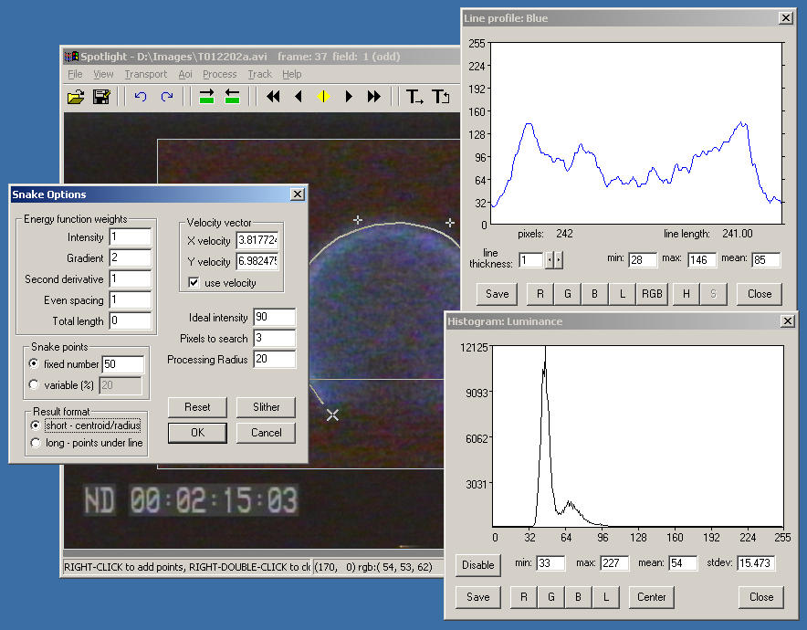
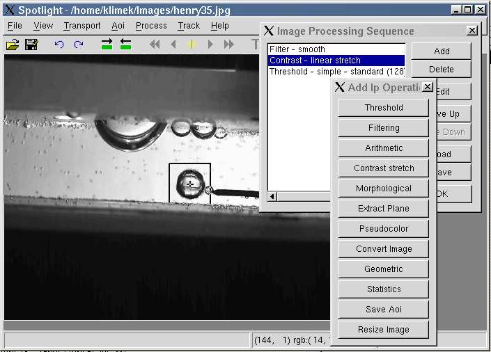
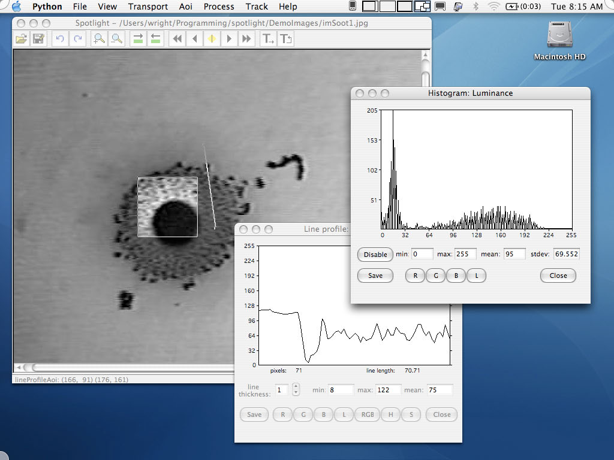

Spotlight
=========

Spotlight is open source software for image analysis and object tracking.

Spotlight was designed to perform image analysis on sequences of images, such as those generated by microgravity combustion and fluid physics experiments on the International Space Station and Space Shuttle. Spotlight was developed for internal use at NASA, but released to the public in 2003.

Features
--------

Spotlight performs analysis on single images, sequence of images, or video files. Image processing operations can be employed to enhance the image before various statistics and measurement operations are performed. An arbitrarily large number of objects can be analyzed simultaneously with independent areas of interest, and tracked from frame to frame. Spotlight saves results in a text file that can be imported into other programs for graphing or further analysis.

Example uses of Spotlight:

Snake (active contour line) tool is used to track the perimeter of candle flame in microgravity showing the characteristic spherical shape. Also shown are the snake options dialog box as well as interactive line profile and histogram analysis tools. Platform shown: Windows 2000.

Center Tracking AOI (area of interest) is employed to track the center point of a bubble as it separates from an injector. Image processing sequence dialog box is shown. Platform shown: Linux.

Interactive histogram and line profile tools are used to measure some features of a soot image. Platform shown: Macintosh

History
-------

Spotlight is the fourth generation of image tracking software developed for microgravity science object tracking starting in the early 1990s.

The early versions of the software were named *Tracker*. Tracker started as a motion picture film transport controller to capture individual frames of microgravity science experiment movies recorded on sounding rockets, Space Shuttle, and Mir Space Station flights. It was extended to work with video images recorded in space on LaserDisk, several analog video tape formats, digital video tape, and finally digital files captured and stored on computers. Dozens of microgravity science experiments on the International Space Station have used Tracker and Spotlight to analyze their data.

Spotlight is the Tracker software rewritten from scratch to be cross-platform and freely redistributable.

Spotlight's authors moved on to other work within NASA in 2006, and Spotlight has not seen much software development since then. There are currently known (but probably solvable) problems running Spotlight on modern operating system due to changes in the software libraries that are used.

Authors
-------

Spotlight's developers are:

Robert Klimek,   Physicist, NASA Glenn Research Center (retired)  
Dr. Ted Wright,  Engineer,  NASA Glenn Research Center (ted.wright@nasa.gov)

NASA Glenn Research Center  
21000 Brookpark Road  
Cleveland Ohio, 44135
